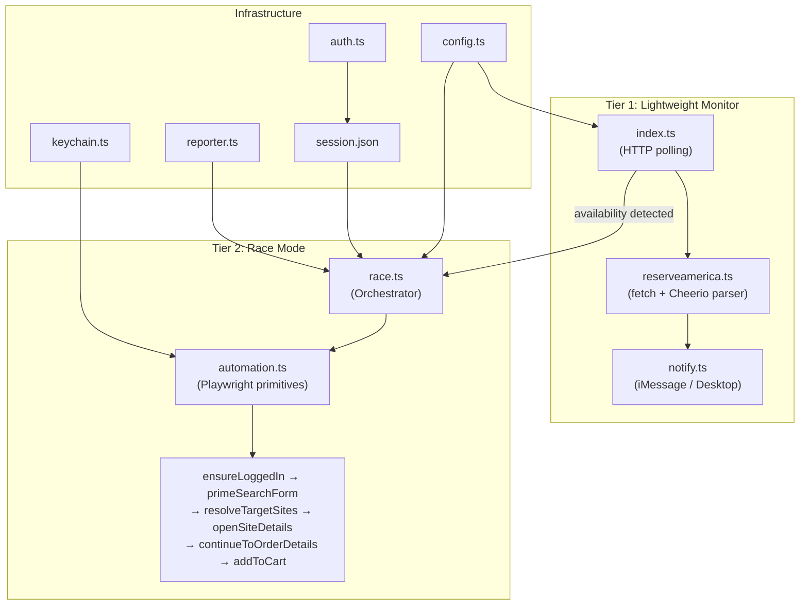
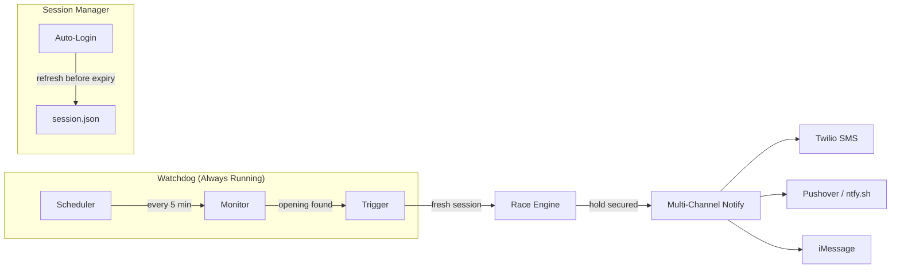

# Bear Lake Booker — Architecture Analysis & Roadmap

## What You Have Today

### Current Capabilities

| Capability | Status | How It Works |
|---|---|---|
| **Availability Detection** | ✅ | HTTP POST → parse calendar HTML via Cheerio |
| **Continuous Monitoring** | ✅ | `index.ts` with `--interval` flag |
| **Parallel Racing** | ✅ | `race.ts` launches N Playwright agents in parallel |
| **Multi-Hold** | ✅ | `--bookingMode multi --maxHolds N` |
| **Sequential Mode** | ✅ | `--sequential` for single-browser, one-at-a-time booking |
| **Scheduled Launch** | ✅ | `--time HH:MM:SS` to fire at exact moment |
| **Hybrid Trigger** | ✅ | HTTP poll → browser launch only when opening detected |
| **Error Recovery** | ✅ | Error page detection + 3-attempt retry with 5s backoff |
| **Site Targeting** | ✅ | `--sites BH03,BH07` allowlist + round-robin distribution |
| **Stealth** | ✅ | `playwright-extra` + `puppeteer-extra-plugin-stealth` |
| **Auto Login** | ✅ | Keychain credentials → form fill |
| **Add to Cart** | ✅ | Full flow from site details → order details → shopping cart |
| **Notifications** | ✅ | macOS Desktop + iMessage via `osascript` |
| **Run Summaries** | ✅ | JSON logs in `logs/` directory |

---

## What's Missing — The Gaps

### 🔴 Critical Gaps (Blocking Fully Automated Runs)

#### 1. No "Fire and Forget" Daemon Mode
- The tool requires a human to start it manually at the right time
- No way to run in the background as a persistent service that monitors 24/7 and fires race mode automatically when a cancellation opens up
- **Impact**: You have to be at the keyboard to catch cancellations

#### 2. Session Expiry / Auto-Refresh
- `session.json` eventually expires, and there's no auto-renewal
- `auth.ts` requires *manual* browser interaction — you open Chrome, log in by hand, press Enter
- If a 24/7 daemon detected an opening at 3 AM, the session would be stale
- **Impact**: Unattended runs will fail silently after session timeout

#### 3. No Date Range Scanning
- Both `index.ts` and `race.ts` target a *single* arrival date
- If you want to monitor `06/01 – 08/31`, you'd have to run ~90 separate instances
- **Impact**: Dramatically limits coverage for flexible-date trips

#### 4. No Cart → Checkout Completion
- The automation boundary is intentionally at the Shopping Cart — the reservation is held but never *paid for*
- ReserveAmerica holds expire (typically 15 min), so after a successful race you're in a sprint to pay manually
- **Impact**: Risk of losing the hold if you're not hovering over the browser

### 🟡 Important Gaps (Quality-of-Life & Reliability)

#### 5. Single Park / Single Loop Lock-in
- `PARK_URL` and loop are hardcoded to Bear Lake BIRCH
- Can't scan multiple loops or parks in one invocation
- **Impact**: Limits to one campground loop at a time

#### 6. No Persistence / State Across Runs
- Once the process exits, all run state is gone (aside from the JSON summary)
- No database or file-backed state tracking "I already tried BH03 at 2:17 PM"
- **Impact**: Redundant attempts and no historical intelligence

#### 7. No Rate Limiting Awareness
- The Cloudflare/WAF layer can (and does) throttle
- No adaptive backoff — retries are blind 5s delays, not informed by HTTP 429 or response time
- **Impact**: Risk of IP bans during aggressive polling

#### 8. No Mobile / Remote Notifications
- Notifications are macOS-only (`osascript`)
- No push notifications, SMS (Twilio), email, or webhook when you're away from the laptop
- **Impact**: Miss critical alerts when away from the Mac

---

## What a Master Architect Would Change

### Phase 1: "Set It and Forget It" — The Autonomous Pipeline

> **Goal**: Transform from a manually-triggered CLI tool into a self-sustaining watchdog.

| Change | What & Why |
|--------|-----------|
| **Watchdog wrapper** | New `src/watchdog.ts` — a long-running process that combines monitor + race in a single lifecycle. When monitor detects an opening, it *internally* launches the race engine (no manual step). Uses a state machine: `IDLE → MONITORING → RACING → COOLDOWN → MONITORING`. |
| **Auto session refresh** | `ensureLoggedIn` in `automation.ts` already works. Wrap session management so it proactively refreshes *before* expiry (check cookie expiration timestamps). If keychain creds exist, auto-login without manual browser. |
| **Date range scanning** | Add `--dateRange 06/01/2026-08/31/2026` that generates batched searches across a window. HTTP monitor is cheap — scan 14 dates per request (calendar returns a 2-week window), so ~7 requests cover a full summer. |
| **Multi-channel notifications** | Abstract `notify.ts` into a pluggable system. Add `ntfy.sh` (free, no API key) or Pushover for phone push notifications. Add webhook support for Slack/Discord. |

### Phase 2: "Smarter Racing" — Intelligence Layer

| Change | What & Why |
|--------|-----------|
| **Adaptive rate limiting** | Track response times from `reserveamerica.ts`. If mean response time exceeds 2s or you see 429/5xx, exponentially back off. Monitor the Cloudflare `cf-team` headers you're already capturing in `inspect.ts`. Prevents IP blocking. |
| **State persistence** | SQLite (via `better-sqlite3`) or even a simple JSON file: track every availability check, every race attempt, every hold. This enables "don't retry BH03 for 10 minutes if it just failed" logic. |
| **Multi-loop scanning** | Expand `--loop BIRCH,COTTONWOOD` to scan multiple loops per run. The search form POST already takes a loop value — just iterate. |
| **Cancellation prediction** | Bear Lake has predictable cancellation patterns (72-hour policy, weekend spikes). A simple heuristic — "check every 30 seconds instead of 5 minutes when we're `≤ 72 hours` before a popular weekend" — would dramatically increase hit rate. |
| **Site preference scoring** | Add a `site-prefs.json` with ranked preferences (waterfront, shade, proximity to bathrooms). When multiple sites open simultaneously, agents prioritize the highest-scored sites first. |

### Phase 3: "Complete the Loop" — Cart to Confirmation

> [!WARNING]
> This is the highest-risk phase. Automating payment touches money and has legal/TOS implications. Recommend keeping this as a manually-triggered, *supervised* step.

| Change | What & Why |
|--------|-----------|
| **Payment-ready mode** | Add `--autoCheckout` flag (default off). When enabled, after cart hold, auto-fill payment details from Keychain and submit. Only with explicit consent. |
| **Hold timer** | After a successful cart hold, display a visible countdown of the hold expiry. Send an escalating series of notifications: "15 min left", "5 min left", "EXPIRING NOW". |
| **Cart management** | `view-cart.ts` already exists. Extend it to programmatically read cart contents and remove unwanted holds, freeing capacity for better sites. |

---

## Recommended Priority Order

| # | Action | Effort | Impact | Risk |
|---|--------|--------|--------|------|
| 1 | **Date range scanning** | Low (2 hrs) | 🔥🔥🔥 | Low |
| 2 | **Watchdog mode** (monitor → race pipeline) | Medium (4 hrs) | 🔥🔥🔥 | Low |
| 3 | **Auto session refresh** | Medium (3 hrs) | 🔥🔥🔥 | Medium |
| 4 | **Push notifications** (ntfy.sh) | Low (1 hr) | 🔥🔥 | None |
| 5 | **Multi-loop scanning** | Low (1 hr) | 🔥🔥 | Low |
| 6 | **Hold timer / expiry alert** | Low (1 hr) | 🔥🔥 | None |
| 7 | **Adaptive rate limiting** | Medium (2 hrs) | 🔥🔥 | Low |
| 8 | **Site preference scoring** | Low (1 hr) | 🔥 | None |
| 9 | **State persistence** (SQLite) | Medium (3 hrs) | 🔥 | Low |
| 10 | **Payment-ready mode** | High (5 hrs) | 🔥🔥🔥 | ⚠️ High |

---

## Summary

The current codebase is **solid engineering** — clean separation of concerns, good retry logic, stealth measures, and a working end-to-end flow from detection to cart hold. The audit report confirms this: 🟢 across the board.

The single biggest architectural gap is that **the system is reactive (you trigger it) instead of proactive (it triggers itself)**. Closing that gap with a watchdog + date range scanning + auto session refresh would transform this from "a tool you use when you're at your desk" into "a silent sentinel that catches cancellations at 3AM and texts you to pay."

The second biggest gap is **date range scanning** — right now you're searching one date at a time while the ReserveAmerica calendar naturally returns 14 days of data per request. You're leaving free information on the table.

Everything else (multi-channel notifications, adaptive rate limiting, site preferences) is polish that compounds the value of those two core improvements.
